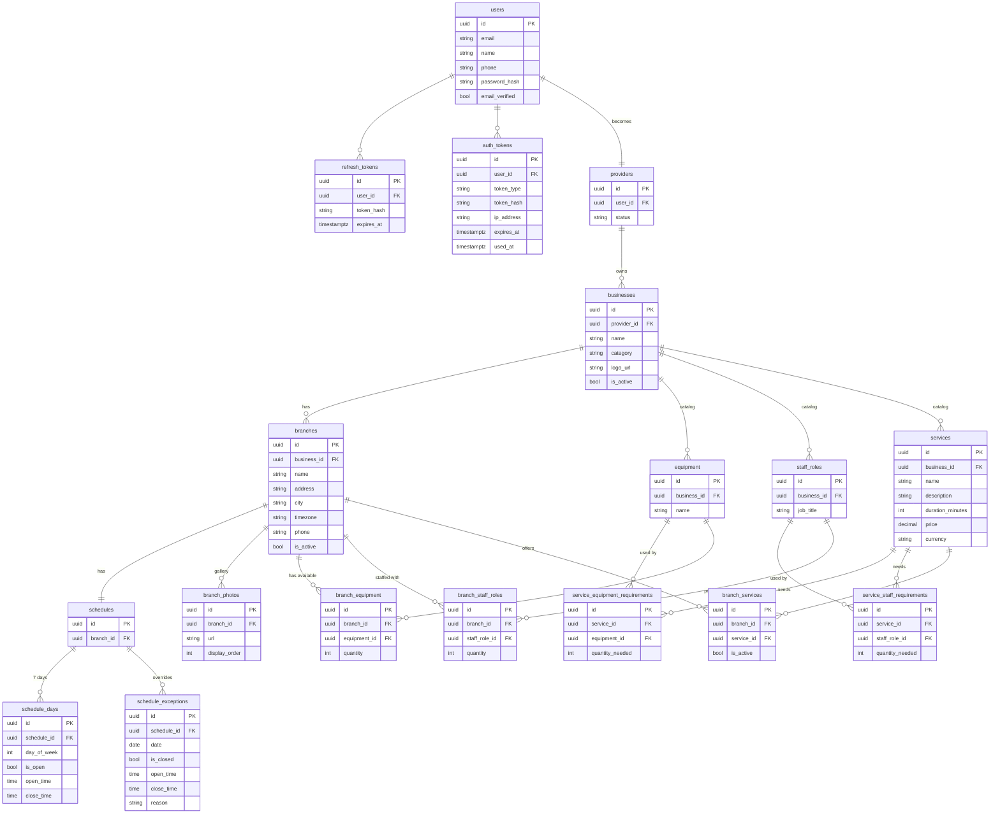

# Database Schema — Table Relations

> Example: **Glamour Hair Salon** (single business, two branches)

---

## Hair salon example walkthrough

| Table | Row |
|-------|-----|
| `users` | Maria Jonaitis |
| `providers` | Maria as provider |
| `businesses` | Glamour Hair Salon · beauty |
| `branches` | Main Street · City Center |
| `equipment` | Styling Chair · Hair Washing Station _(business-level)_ |
| `staff_roles` | Hair Stylist · Colorist _(business-level)_ |
| `services` | Haircut · Hair Coloring · Blow Dry _(business-level)_ |
| `service_equipment_requirements` | Haircut → 1× Styling Chair |
| `service_staff_requirements` | Haircut → 1× Hair Stylist |
| `branch_equipment` | Main Street → 3× Styling Chair, 2× Washing Station |
| `branch_staff_roles` | Main Street → 2× Hair Stylist, 1× Colorist |
| `branch_services` | Main Street → Haircut ✓ · Hair Coloring ✓ · Blow Dry ✓ |
| `schedules` + `schedule_days` | Main Street: Mon–Fri 09:00–19:00, Sat 10:00–17:00 |
| `schedule_exceptions` | Main Street: 2026-12-25 closed (Christmas) |
| `branch_photos` | Main Street: 4 interior photos |
